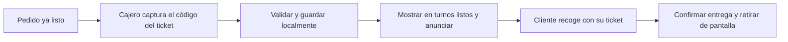

# Comal++ · Turnos listos para recoger

Sistema local de llamados para la cafetería Comal++ de la Facultad de Informática de la Universidad Autónoma de Querétaro (UAQ).

El cajero introduce manualmente el código de un ticket cuando el pedido ya está listo. Al registrarlo, se añade directamente a la lista de turnos listos para recoger y se muestra en la pantalla de clientes.

## Estado del proyecto

Proyecto en redefinición de alcance. Se eliminó la implementación anterior y su documentación complementaria para comenzar desde estos requisitos. El repositorio conserva únicamente este README y los archivos de Git; todavía no contiene una nueva aplicación ejecutable.

Este documento sustituye el enfoque anterior de registro al cobrar y seguimiento de preparación. La selección de tecnologías y el diseño definitivo quedan pendientes de adecuarse al nuevo alcance.

## Requisitos confirmados

1. **Captura exclusivamente manual.** No se tiene acceso al software de tickets. El cajero captura el código impreso; no habrá integración con dicho software, importación automática ni generación de una segunda numeración.
2. **Solo turnos listos.** El sistema registra y gestiona pedidos que ya están listos para recoger. No existe un estado, lista ni panel de pedidos en preparación. Registrar un ticket equivale a añadirlo directamente a los listos.
3. **Funcionamiento completo sin internet.** La operación principal debe poder arrancar, registrar tickets, mostrar turnos, reproducir llamados y confirmar entregas sin conexión a internet.
4. **Todo local.** La aplicación, los datos y los recursos necesarios se ejecutan y almacenan en el equipo o infraestructura local de la cafetería. No se requiere alojamiento en la nube ni servicios externos para operar.
5. **Funciones conectadas opcionales.** Podrán añadirse funciones que utilicen internet, pero serán complementarias. Su ausencia o falla no deberá bloquear ni degradar el flujo local de turnos.
6. **Diseño basado en referencias.** La paleta de colores será similar a las imágenes que proporcione el usuario. Las imágenes están pendientes; aún no se fijan colores ni se adopta la paleta del mockup anterior.

## Flujo de operación

El cobro, la impresión de tickets y la preparación se realizan fuera del sistema de turnos.

1. Cuando el pedido está listo, el cajero introduce manualmente el código de su ticket.
2. El sistema valida el código y guarda el turno localmente como **Listo para recoger**.
3. La pantalla pública muestra el código y reproduce su llamado por voz con recursos locales.
4. Si es necesario, el cajero puede repetir el llamado sin crear otro turno.
5. El cliente presenta su ticket y recoge su pedido.
6. El cajero confirma la entrega; el turno deja de aparecer en la lista pública de listos.

## Interfaces y acciones

### Panel de caja

- Capturar y añadir directamente un ticket listo para recoger.
- Consultar y buscar turnos pendientes de recoger.
- Repetir el llamado de un turno.
- Confirmar la entrega y retirarlo de la lista de listos.
- Retirar un ticket capturado por error, con confirmación. Para corregirlo, retirar el registro incorrecto y capturar el código correcto; nunca enviarlo a preparación.
- Mostrar errores de validación, guardado o disponibilidad local sin presentar acciones fallidas como confirmadas.

### Pantalla pública

- Mostrar códigos grandes y legibles de los pedidos listos para recoger.
- Destacar el llamado más reciente y mantener visibles los demás turnos pendientes.
- Indicar que el cliente debe presentar su ticket.
- Mostrar «No hay pedidos listos para recoger» cuando la lista esté vacía.
- Reproducir llamados en español, uno por uno, con activación y prueba de audio.
- Avisar si se pierde la comunicación local y la información puede estar desactualizada.
- Ser de consulta: los clientes no modifican los turnos.

## Reglas de los tickets

- Se conserva el código del ticket existente. El formato confirmado previamente es `01`–`99`, incluidos los ceros iniciales; cualquier cambio de formato deberá validarse antes de implementar.
- El código visible y el identificador interno del registro son independientes.
- Se rechaza un código que ya esté en la lista de listos pendientes de recoger, sin sobrescribir ni cerrar el turno anterior.
- Un código puede reutilizarse cuando su registro anterior haya sido entregado o retirado, creando un registro nuevo.
- Los turnos se muestran según su registro como listos, sin asumir un orden numérico de entrega.
- Un doble clic no debe duplicar registros ni llamados automáticos. Repetir un llamado es una acción explícita.
- Los turnos permanecen hasta confirmar su entrega o retirarlos por error. No se borran automáticamente al recargar, reiniciar el equipo o cambiar de día.
- Confirmar entrega o retirar un turno no modifica cobros ni procesa devoluciones.

## Operación local y sin internet

- Distribuir localmente todos los recursos necesarios: interfaz, fuentes, iconos y audios. No depender de CDN, APIs remotas, autenticación en línea ni descargas durante el arranque o la operación habitual.
- Guardar los turnos y sus cambios en almacenamiento persistente local y recuperarlos después de reiniciar.
- Usar audios incluidos con la instalación o una voz española instalada y comprobada sin internet. Un servicio de voz remoto no cumple este requisito.
- Actualizar la pantalla mediante comunicación local. Si se usan varios equipos, la red local debe seguir funcionando sin acceso a internet; el montaje no debe depender de Wi-Fi.
- Mantener el funcionamiento normal si solo falla internet. Si falla el servicio local, el enlace entre equipos o el suministro eléctrico, mostrar el problema cuando sea posible y usar los tickets impresos y el llamado verbal como respaldo.
- Definir un mecanismo local de respaldo y recuperación de datos antes de la operación definitiva.

## Contexto de instalación

Se mantiene como contexto previo una cafetería y una caja, con tres pantallas que mostrarán el mismo contenido y bocinas disponibles. El equipo de caja permite instalar programas, pero sus especificaciones y el cableado siguen pendientes de validación. Se evaluará una salida pública replicada mediante HDMI o una conexión local cableada, sin depender de internet.

La planificación anterior contemplaba dos estudiantes, seis horas semanales por persona y un prototipo en cuatro semanas, con instalación definitiva posterior. El calendario deberá actualizarse conforme al nuevo alcance y a la fecha de reinicio acordada.

## Fuera del alcance principal

- Seguimiento de pedidos en preparación, registro al cobrar o panel de cocina.
- Acceso o integración con el software actual de tickets.
- Cobros, inventario, facturación, impresión de tickets o gestión de artículos del pedido.
- Servicios en la nube o conexión a internet como requisitos de funcionamiento.

## Pendientes antes de implementar

- Recibir las imágenes de referencia y definir la paleta de colores.
- Validar el equipo, sistema operativo, pantallas, bocinas y distribución física.
- Elegir las tecnologías y el formato de instalación que cumplan la operación completamente local.
- Concretar acceso de operadores, conservación del historial y procedimiento de respaldo.
- Actualizar el calendario y acordar criterios de aceptación del nuevo prototipo.

La validación deberá incluir el flujo completo sin internet, persistencia después de reiniciar, rechazo de duplicados, reutilización de códigos cerrados, retiro de capturas incorrectas y reproducción de llamados con recursos locales.
